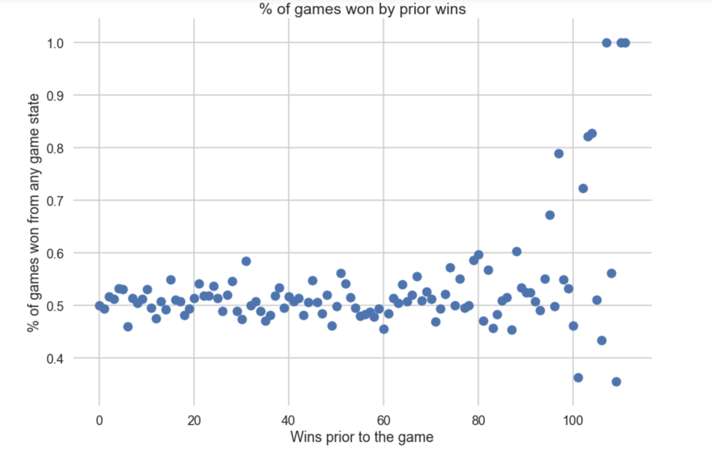

## Some notes from our EDA

#### Wins
Initially, we only scraped the number of wins that the team at bat had, and were planning on using that as a predictor for who would win the game. However, when we scattered the number of wins against the percentage of times that team won a game, we saw the following:

We believe that the extreme values at the far right are due to the fact that very few teams reach that many wins. For example, if one team wins 100 games, then the last game of their season is 101 games, but no other teams reach 100 wins, then this predictor would only have one data point. We believe that the clustering of data arond 50% in the middle area is due to the fact that many teams reach a decent number of wins throughout the season, so there are many games played when teams have 60-80 wins. This means that we would expect around half of those games to be wins and half losses. Thus, we decided that we should include both the batting team's wins _and_ the fielding team's wins when we rescraped our data the EDA. 
#### Inning x Score Differential
