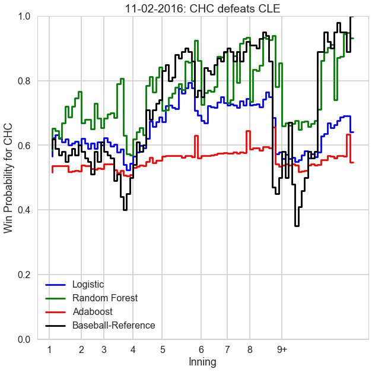

## Contents
{:.no_toc}
*  
{: toc}

### Import Libraries, Import Data


```python
%matplotlib inline
import numpy as np
import scipy as sp
import matplotlib as mpl
import matplotlib.cm as cm
import matplotlib.pyplot as plt
import pandas as pd
import time
from bs4 import BeautifulSoup, Comment
import requests
from operator import itemgetter
import os
from IPython.display import clear_output
from sklearn.linear_model import LogisticRegressionCV
from sklearn.linear_model import LogisticRegression
from sklearn.linear_model import LinearRegression
import sklearn.metrics as metrics
from sklearn.preprocessing import PolynomialFeatures
from sklearn.discriminant_analysis import LinearDiscriminantAnalysis
from sklearn.discriminant_analysis import QuadraticDiscriminantAnalysis
from sklearn.ensemble import RandomForestClassifier
from sklearn.neighbors import KNeighborsClassifier
from sklearn.tree import DecisionTreeClassifier
from sklearn.model_selection import cross_val_score
from sklearn.metrics import accuracy_score
from sklearn.metrics import confusion_matrix
from sklearn.ensemble import AdaBoostClassifier
import warnings
import operator
pd.set_option('display.width', 500)
pd.set_option('display.max_columns', 100)
pd.set_option('display.notebook_repr_html', True)
import seaborn as sns
sns.set_style("whitegrid")
sns.set_context("poster")
```


```python
df_full = pd.read_csv("full_deg3.csv")
df_pitcher = pd.read_csv("pitcher_data.csv")

del df_full["Unnamed: 0"]
del df_pitcher["Unnamed: 0"]
```


```python
df_full = df_full.sort_values(['game_id', 'play_number'], ascending=[1, 1])
df_pitcher = df_pitcher.sort_values(['game_id', 'play_number'], ascending=[1, 1])
```


### Helper Functions


```python
def conf_mat(y_real, y_pred):
    tn, fp, fn, tp = confusion_matrix(y_real, y_pred).ravel()
    
    print("\nCONFUSION MATIX:")
    print("{0:6} {1:6} {2:6}".format("", "pred +", "pred -"))
    print("{0:6} {1:6} {2:6}".format("true +", tp, fn))
    print("{0:6} {1:6} {2:6}".format("true -", fp, tn))
    
    if tp == 0 and fp == 0:
        tpr = 0
    else:
        tpr = tp / (tp + fp)
        
    if tn == 0 and fn == 0:
        tnr = 0
    else:
        tnr = tn / (tn + fn)
    
    print("\nTRUE POSITIVE:", tpr)
    print("TRUE NEGATIVE:", tnr)
    
def classification_accuracy(y_true, y_pred):
    total_missed = 0
    for i in range(len(y_true)):
        if y_true[i] != y_pred[i]:
            total_missed += 1
    return 1 - (total_missed/len(y_true))

def predicted_prob(pred_prob, win_or_not):
    win_prob = []
    
    print("writing probabilities")
    
    # record predicted win probabilities at each step
    for i in range(len(pred_prob)):
        # if team wins
        if win_or_not[i] == 1:
            win_prob.append(pred_prob[i][1])
        else:
            win_prob.append(pred_prob[i][0])
            
        if i % 200000 == 0:
            print("iter", i)
            
    prob_change = []
    
    play_counts = np.array(df_full["play_number"])
    
    print("writing probability changes")
    
    # calculate change in win probability between each event
    for i in range(len(win_prob)):
        if play_counts[i] == 1:
            prob_change.append(win_prob[i] - 0.5)
        else:
            prob_change.append(win_prob[i] - win_prob[i - 1])
            
        if i % 200000 == 0:
            print("iter", i)
            
    return [win_prob, prob_change]

def split_data(df):
    msk = np.random.rand(len(df)) < 0.5

    data_train = df[msk]
    data_test = df[~msk]
    
    return (data_train, data_test)

def sample(df, k):
    n = df.shape[0] # No. of training points
    
    # Choose random indices of size 'k'
    subset_ind = np.random.choice(np.arange(n - k), 1)[0]
    
    # Get predictors and reponses with the indices
    subset = df.iloc[subset_ind:subset_ind + k].copy()
    
    return subset
```


### Split into Test and Train, Get Predictors


```python
response = "win"
not_to_include = ["wWPA", "wWE", "play_number", "game_id"]
predictors = [x for x in list(df_full) if x != response and x not in not_to_include]
```


```python
train, test = split_data(df_full)
```


### Logistic Regression


```python
def fit_log_model(df_full, df, dfTest, df_pitcher, response, predictors):

    # get test/train sets
    y_train = df[response]
    y_test = dfTest[response]

    x_train = df[predictors]
    x_test = dfTest[predictors]
    
    log_model = LogisticRegressionCV()
    
    print("fitting")

    log_model.fit(x_train, y_train)

    print("MODEL SCORE:", log_model.score(x_test, y_test))

    y_pred_test = log_model.predict(x_test)
    
    conf_mat(y_test, y_pred_test)
    
    print("\npredicting probabilities")
    
    x_full = df_full[predictors]
    y_full = df_full[response]
    
    # predict probabilities of each event for every game in dataset
    pred_prob = log_model.predict_proba(x_full)
    
    [win_prob, prob_change] = predicted_prob(pred_prob, np.array(y_full))
    
    # put the predicted probabilities in the pitcher dataframe
    df_pitcher["logistic_prob"] = win_prob
    df_pitcher["logistic_prob_change"] = prob_change
    
    print("done fitting logistic regression model")
    
fit_log_model(df_full, train, test, df_pitcher, response, predictors)
```


    fitting
    MODEL SCORE: 0.704860582051
    
    CONFUSION MATIX:
           pred + pred -
    true + 217197  76264
    true -  94192 189891
    
    TRUE POSITIVE: 0.697510188221
    TRUE NEGATIVE: 0.713460201762
    
    predicting probabilities
    writing probabilities
    iter 0
    iter 200000
    iter 400000
    iter 600000
    iter 800000
    iter 1000000
    writing probability changes
    iter 0
    iter 200000
    iter 400000
    iter 600000
    iter 800000
    iter 1000000
    done fitting logistic regression model


### Random Forest


```python
subset = sample(df_full, 5000)

train_sub, test_sub = split_data(subset)
```


```python
def fit_rf_model(df_full, df_train, df_test, df_pitcher, preds, response, n_estimators, max_depth):
    rf_model = RandomForestClassifier(n_estimators = n_estimators, max_depth = max_depth)
    
    print("fitting model")
    
    rf_model.fit(df_train[preds], df_train[response])
    
    print("predicting")
    
    y_hat = rf_model.predict(df_test[preds])
    print("Overall accuracy: {}".format(classification_accuracy(df_test['win'].values, y_hat)))
    conf_mat(df_test[response].values, y_hat)
    
    print("predicting probabilities")
    
    pred_prob = np.array(rf_model.predict_proba(df_full[preds]))
    
    print(pred_prob.shape)
    
    [win_prob, prob_change] = predicted_prob(pred_prob, np.array(df_full[response]))
    
    # put the predicted probabilities in the pitcher dataframe
    df_pitcher["rf_prob"] = win_prob
    df_pitcher["rf_prob_change"] = prob_change
    
fit_rf_model(df_full, train, test, df_pitcher, predictors, response, 256, 48)
```


    fitting model
    predicting
    Overall accuracy: 0.7178189021096228
    
    CONFUSION MATIX:
           pred + pred -
    true + 216927  76534
    true -  86438 197645
    
    TRUE POSITIVE: 0.715069305952
    TRUE NEGATIVE: 0.720861189223
    predicting probabilities
    (1156906, 2)
    writing probabilities
    iter 0
    iter 200000
    iter 400000
    iter 600000
    iter 800000
    iter 1000000
    writing probability changes
    iter 0
    iter 200000
    iter 400000
    iter 600000
    iter 800000
    iter 1000000


## Adaboost


```python
def ada_fit(df, train, test, size, depth, predictors, response):
    ada = AdaBoostClassifier(DecisionTreeClassifier(max_depth=depth), 
                                 n_estimators=size, learning_rate=0.05)
    ada.fit(train[predictors], train[response])
    y_hat = ada.predict(test[predictors])
    print("Overall accuracy: {}".format(classification_accuracy(test[response].values, y_hat)))
    conf_mat(test[response].values, y_hat)
    
    pred_prob = np.array(ada.predict_proba(df[predictors]))
    
    [win_prob, prob_change] = predicted_prob(pred_prob, np.array(df[response]))
    
    # put the predicted probabilities in the pitcher dataframe
    df_pitcher["ada_prob"] = win_prob
    df_pitcher["ada_prob_change"] = prob_change
    
best_size_ada = 128
best_depth = 5

ada_fit(df_full, train, test, best_size_ada, best_depth, predictors, response)
```


    Overall accuracy: 0.7210134639092433
    
    CONFUSION MATIX:
           pred + pred -
    true + 215212  78249
    true -  82878 201205
    
    TRUE POSITIVE: 0.72196987487
    TRUE NEGATIVE: 0.719993272596
    writing probabilities
    iter 0
    iter 200000
    iter 400000
    iter 600000
    iter 800000
    iter 1000000
    writing probability changes
    iter 0
    iter 200000
    iter 400000
    iter 600000
    iter 800000
    iter 1000000


### Game Visualization Code


```python
def make_plot(game_id, filename):
    game = df_pitcher.loc[df_pitcher["game_id"] == game_id]
    winner = (game[game["win"] == 1].iloc[0])["@Bat"]
    loser = (game[game["win"] == 0].iloc[0])["@Bat"]
    innings = sorted(set(game["Inn"]))
    ticks = []
    for inning in innings:
        cur = game[game["Inn"] == inning].iloc[0]["play_number"] - 1
        ticks.append(cur)
    plt.figure(figsize=(10,10))
    plt.step(game["play_number"], game["logistic_prob"], color="blue", label="Logistic")
    plt.step(game["play_number"], game["rf_prob"], color="green", label="Random Forest")
    plt.step(game["play_number"], game["ada_prob"], color="red", label="Adaboost")
    plt.step(game["play_number"], np.array(game["wWE"])/100, color="black", label="Baseball-Reference")
    plt.xticks(ticks, innings)
    plt.xlabel("Inning")
    plt.ylabel("Win Probability for " + winner)
    plt.ylim([0,1])
    plt.legend()
    year, month, day = game_id[3:7], game_id[7:9], game_id[9:11]
    plt.title("{}-{}-{}: {} defeats {}".format(month, day, year, winner, loser))
    plt.savefig("game{}.png".format(filename), dpi=300)

game_ids = ["CLE201610250", "CLE201610260", "CHN201610280", "CHN201610290", "CHN201610300",
      "CLE201611010", "CLE201611020"]
for i,game_id in enumerate(game_ids):
    make_plot(game_id, i+1)
```





### Player Visualization Code


```python
def calculate_total_win_prob_added(df, prob_var):
    pitchers = set(df["Pitcher"])

    pitcher_WPA = {}
    pitcher_count = {}
    print("number of pitchers:", len(pitchers))

    for i,pitcher in enumerate(pitchers):
        pitcher_WPA.setdefault(pitcher, 0)
        pitcher_count.setdefault(pitcher, 0)

        pitcher_rows = df.loc[df['Pitcher'] == pitcher].sort_values(['game_id', 'play_number'], ascending=[1, 1])
        pitcher_count[pitcher] += pitcher_rows.shape[0]

        for index, row in pitcher_rows.iterrows():
            if int(row["win"]) == 1:
                pitcher_WPA[pitcher] += float(row[prob_var])
            else:
                pitcher_WPA[pitcher] -= float(row[prob_var])

        if i % 100 == 0 and i != 0:
            clear_output()
            print("number of pitchers:", len(pitchers))
            print("iter", i)

    pitcher_all = []
    for pitcher,wpa in pitcher_WPA.items():
        pitcher_all.append([pitcher, pitcher_count[pitcher], wpa])

    return pitcher_all

clear_output()

pitcher_scores = calculate_total_win_prob_added(df_pitcher, "rf_prob_change")
```


    number of pitchers: 1521
    iter 1500


```python
sorted_pitchers = sorted(pitcher_scores, key=operator.itemgetter(2), reverse = True)

x_pos_pitch = np.arange(len(sorted_pitchers[:30]))
plt.figure(figsize=(10,10))
plt.bar(x_pos_pitch, [x[2] for x in sorted_pitchers[:30]], align='center', alpha=0.5)
plt.xticks(x_pos_pitch, [x[0] for x in sorted_pitchers[:30]], rotation='vertical', fontsize=12)
plt.xlabel('Pitcher')
plt.title('Top 30 Pitchers by WPA, 2012-2017 (Random Forest)')
plt.ylabel('WPA')
plt.savefig("top30pitchers.png",dpi=300)
plt.show()
```


```python
x_pos_pitch = np.arange(len(sorted_pitchers[-30:]))
plt.figure(figsize=(10,10))
plt.bar(x_pos_pitch, [x[2] for x in sorted_pitchers[-30:]], align='center', alpha=0.5)
plt.xticks(x_pos_pitch, [x[0] for x in sorted_pitchers[-30:]], rotation='vertical', fontsize=12)
plt.xlabel('Pitcher')
plt.title('Bottom 30 Pitchers by WPA, 2012-2017 (Random Forest)')
plt.ylabel('WPA')
plt.savefig("worst30pitchers.png",dpi=300)
plt.show()
```


### Team Visualization Code


```python
df_ninth_inning = df_pitcher.loc[df_pitcher["Inn"] == "9+"]
```


```python
def calculate_team_eight_ninth_prob(df, prob_var):
    teams = set(df["@Bat"])
    
    team_WPA = {}
    print("number of teams:", len(teams))
    
    for i,team in enumerate(teams):
        team_WPA.setdefault(team, 0)
        
        team_rows = df.loc[df['@Bat'] == team].sort_values(['game_id', 'play_number'], ascending=[1, 1])
        
        for index, row in team_rows.iterrows():
            if int(row["win"]) == 1:
                team_WPA[team] += float(row["rf_prob_change"])
            else:
                team_WPA[team] -= float(row["rf_prob_change"])
            
        if i % 5 == 0 and i != 0:
            clear_output()
            print("number of teams:", len(teams))
            print("iter", i)
            
    team_all = []
    for team,wpa in team_WPA.items():
        team_all.append([team, wpa])
                
    return team_all

clear_output()

team_data = calculate_team_eight_ninth_prob(df_ninth_inning, "rf_prob_change")
```


    number of teams: 30
    iter 25


```python
sorted_teams = sorted(team_data, key=operator.itemgetter(1), reverse = True)
```


    ['COL', 'NYY', 'OAK', 'CHW', 'KCR', 'SDP', 'TEX', 'TOR', 'LAD', 'CHC', 'HOU', 'BAL', 'BOS', 'CIN', 'DET', 'LAA', 'MIL', 'ATL', 'MIN', 'SFG', 'CLE', 'PIT', 'WSN', 'PHI', 'TBR', 'STL', 'MIA', 'SEA', 'ARI', 'NYM']


```python
x_pos_team = np.arange(len(sorted_pitchers[:15]))
plt.figure(figsize=(10,10))
plt.bar(x_pos_team, [x[1] for x in sorted_teams[:15]], align='center', alpha=0.5)
plt.xticks(x_pos_team, [x[0] for x in sorted_teams[:15]], rotation='vertical', fontsize=12)
plt.xlabel('Team')
plt.title('Top 30 Pitchers by WPA, 2012-2017 (Random Forest)')
plt.ylabel('WPA')
plt.savefig("top15teams.png",dpi=300)
plt.show()
```


