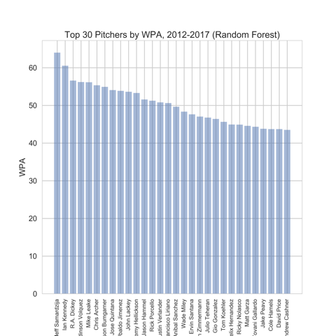
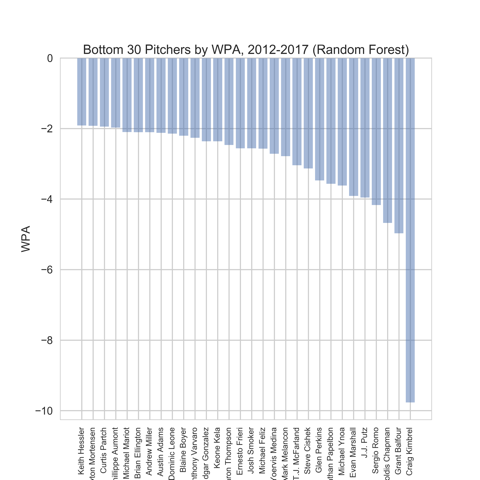
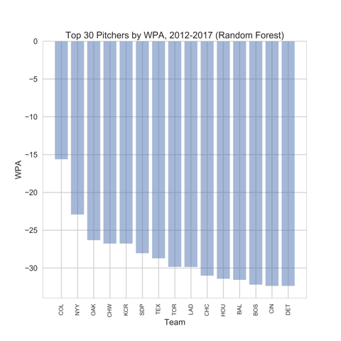

_All the code for our project (except code like the cross validation code that was just a copy from class, and was run in separate notebooks for time purposes) can be found <a href='https://jdeschler.github.io/109final/final_project.html'>here</a>._

[TOC levels=1]: # "#### Table of Contents"
#### Table of Contents
- [**Problem Statement and Motivation**](#problem-statement-and-motivation)
- [**Introduction and Description of Data**](#introduction-and-description-of-data)
- [**Literature Review/Related Work**](#literature-review-related-work)
- [**Modeling Approach and Project Trajectory**](#modeling-approach-and-project-trajectory)
- [**Results, Conclusions, and Future Work**](#results-conclusions-and-future-work)

#### Problem Statement and Motivation
We were tasked with building an **MLB win probability model**, using historical play-by-play data to predict the outcome of a given game.  While win probability, more specifically **win probability added (WPA)**, is a popular metric to evaluate players' performances and managers' decisions, the actual methodology used to calculate WPA is often either overlooked or entirely ignored.  With our project, we hope to bridge this gap, fitting a transparent model that offers accurate predictions.

#### Introduction and Description of Data
The data used in our project was obtained from Baseball-Reference, a popular site that houses MLB game data going back to 1876.  For the purposes of this assignment, we required detailed **play-by-play data**, so we scraped 6 seasons' worth of games between **2012 and 2017**, including all regular season and postseason contests.  

For every event, this data included included a number of features, including:

* the inning
* score
* base-out state
* pitcher
* batter

Our **exploratory data analysis** revealed an intuitive but exciting trend: there appeared to be a strong relationship between score differential and inning, as leads became better predictors of victory later in games.  While perhaps obvious, since opponents have fewer opportunities to mount a comeback as the game progresses, this revelation was very important for the development of our project, as it strongly suggested a need for **higher-order interaction terms**.  We also decided to include **teams' records as predictors** in our model after our exploratory analysis, as by definition, teams with a stronger track record should be expected to win more frequently.

#### Literature Review/Related Work
In <a href='https://www.baseball-reference.com/boxes/ARI/ARI201704020.shtml'> Baseball-Reference</a>'s play-by-play data, the site provides **their own predicted win probabilities at the start of each event**, along with the change in win probability since last event, although no information is given surrounding how these values were produced.  

When considering different potential models for our project, we found <a href='http://homepage.divms.uiowa.edu/~dzimmer/sports-statistics/nettletonandlock.pdf'>Lock</a>'s paper (cited in the Sports project description PDF) to be very helpful.  Although his research focused on NFL data, it highlighted the power of the random forest model and identified significant predictors, inspiring us to pursue a similar approach.

Work done by <a href='https://www.fangraphs.com/library/misc/wpa/'>Fangraphs</a> in explaining their calculations of **Win Probability Added and Leverage Index** were also crucial as we developed a strategy for determining the best players and managers as measured by these metrics.

#### Modeling Approach and Project Trajectory
Since a baseball game can result in **only two distinct outcomes** (a win or a loss), our project can be considered a **binary classification problem**.  Thus, we felt that a **logistic regression model** could serve as an appropriate baseline.  Before fitting our model, we carried out the following procedures to engineer the data:

* Created dummy variables: one for every batter and pitcher in the dataset.  
* One-hot encoded innings:  although innings do happen in sequential order, they <a href='https://jdeschler.github.io/109final/EDA.html#inning-x-score-differential'>may not be linearly related</a> to win probability as their numeric labels suggest, and we wanted to allow our model the flexibility to account for these relationships. 
* Created third-order interaction terms: these could represent the relationships between inning, base-out state, and score differential, among other things.  

After including these features, we fit our logistic model on the dataset. 

This baseline model performed well, registering with a classification accuracy score of 0.705.

After fitting this logistic regression baseline model, we hoped to improve our performance by fitting more **complex ensemble models**, specifically **Random Forests** and **AdaBoost** classifiers.  While noted for their **superior accuracy**, these models were much more difficult from a **computational perspective**, as they require hyperparameter tuning to determine the optimal maximum decision tree depth in each.  

To obtain these values, we performed cross-validation on a smaller sample of our data, using 100,000 data points instead of the almost 1.5 million contained in the entire dataset, in the interests of time.  After completing this cross-validation process, we then fit these ensemble models on the entire dataset.  Each showed small improvements, which were encouraging, although they did not exhibit the significant increase that we had hoped for.  Our final random forest model recorded a classification accuracy score of 0.718, and the AdaBoost model posted a classification accuracy score of 0.721. 
 
#### Results, Conclusions, and Future Work 
Of the 3 models that we fitted to the data, **AdaBoost recorded the best performance** when considering classification accuracy.  This makes sense, as the logistic model is the crudest of our implementations, and the AdaBoost method leverages the power of Random Forests with boosting, identifying the weaknesses of previously fit models and then ensuring that future models take steps to correct these misclassifications.  

However, when considering our win probability plots of the <a href='https://jdeschler.github.io/109final/ws.html'>2016 World Series</a>, it appears that the Random Forest model predicts best the actual probabilities within a game, very closely resembling Baseball-Reference's own probabilities.  It seems that while AdaBoost is very accurate with its binary classifications, the **probabilities themselves are very conservative**, lingering close to 0.5 throughout entire games.  
After fitting our models, although the AdaBoost recorded the highest classification accuracy, we feel that the Random Forest may actually be the most reliable of our algorithms, considering its ability to nearly mirror the probabilities presented by Baseball-Reference.  Thus, when attempting to determine the best pitchers and managers as measured by Win Probability Added, **we choose to use the probabilities generated by our Random Forest model**.  
To calculate Win Probability Added for pitchers, we identified every event in which a pitcher appeared, then calculated the differential between the win probability at the end of that event and the most recent event in which that same pitcher appeared, accounting for swings that may have occurred because of their team’s offensive performances while they watched from the bench.  As determined by our model, the following are the 30 best and worst pitchers by Win Probability Added between 2012 and 2017:

To determine the best managers using only the data at our disposal, we limited our search to the 9th inning, thinking that the best decision makers in baseball should win almost all games in which they enter the final inning of play with a lead.  To accomplish this task, we calculate all probability swings from the 9th inning on.  Surprisingly, we actually find that all of these values are negative.  We hypothesize that this occurs since our model rarely predicts a win probability of 100%, instead hovering near 80% at best.  Thus, when a team enters the 9th with a lead, it has essentially already maximized its projected probability of victory, and if they do actually win, they gain virtually nothing.  However, if they blow their lead and do lose, that results in a huge negative swing.  Thus, these values are very negative, and thus, our definition of the best managers are those that lose the fewest games that they are heavily favored in.  The best teams, and by proxy managers, according to this metric, can be found below:

  
In future research, we would include more data, as we included only 6 seasons' worth in this project.  We also would have liked to include more polynomial terms that could have unlocked stronger relationships, but because of time constraints and computational complexity, we chose to limit the number of predictors as much as possible.        

